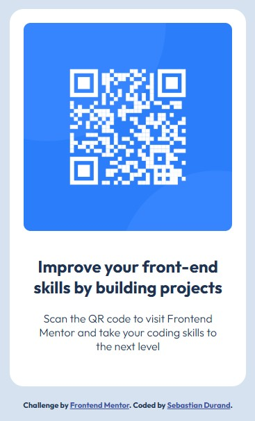

# Frontend Mentor - QR code component solution

Esta es una solución para el [Desafío QR code component Frontend Mentor](https://www.frontendmentor.io/challenges/qr-code-component-iux_sIO_H). Los desafíos de Frontend Mentor te ayudan a mejorar tus habilidades de codificación mediante la creación de proyectos realistas. 

## Tabla de contenido

- [Descipción general](#descripción-general)
  - [Captura de pantalla](#captura-de-pantalla)
  - [Links](#links)
- [Mi proceso](#mi-proceso)
  - [Construído con](#construido-con)
  - [Lo que aprendí](#lo-que-aprendí)
  - [Desarrollo continuo](#desarrollo-continuo)
- [Autor](#autor)

## Descripción general

En este desafío, desarrollé una tarjeta de código QR y su descripcion utilizando HTML y CSS básico. El diseño incluye un código QR centrado dentro de un contenedor, acompañado de un texto descriptivo ubicado justo debajo. Utilicé etiquetas semánticas para estructurar el contenido y estilización básica con CSS para alinear y centrar los elementos. Este proyecto me permitió practicar habilidades fundamentales de diseño web, como el uso de Flexbox para centrar elementos y la aplicación de estilos como márgenes, colores y tipografía, logrando un diseño limpio y minimalista.

### Captura de pantalla



### Links

- URL de la solucion: [https://github.com/dandfres/QR-code-component](https://github.com/dandfres/QR-code-component)
- URL del sitio en vivo: [https://dandfres.github.io/QR-code-component/](https://dandfres.github.io/QR-code-component/)

## Mi proceso

1. Comenzé por planificar la separación de la imagen y el texto dentro de un contenedor
2. Luego importé la fuente y dí estilo al HTML
3. Por último edité el `README.md` y actulicé mi repositorio de github

### Construido con

- HTML5 marcado semántico
- CSS propiedades de personalización
- Modelo de diseño [Flexbox](https://developer.mozilla.org/es/docs/Web/CSS/CSS_flexible_box_layout/Basic_concepts_of_flexbox)
- Fuente de letras [GoogleFonts](https://fonts.google.com/specimen/Outfit)

### Lo que aprendí

En este pequeño proyecto dí un repaso a algunos comandos en git y también aprendí a centrar un box tanto en el eje vertical como horizontal.

---
Algunos comandos de `bash` y codigo `css`:

```bash
git init
git add .
git commit -m "Comentario de confirmacion"
git push
cd ..  
```
```css
parent {
  display: flex;
  height: 100vh;
  justify-content: center;
  align-items: center;
}
```

### Desarrollo continuo

En proyectos futuros, quiero seguir profundizando en el modelo de diseño Flexbox, ya que me parece una herramienta muy útil para crear layouts flexibles y modernos. Además, me gustaría continuar perfeccionando mis habilidades en la elaboración de diseños responsive, ya que considero fundamental adaptarse a diferentes tamaños de pantalla para mejorar la experiencia del usuario.

## Author

- GitHub - [dandfres](https://github.com/dandfres)
- Frontend Mentor - [@dandfres](https://www.frontendmentor.io/profile/dandfres)